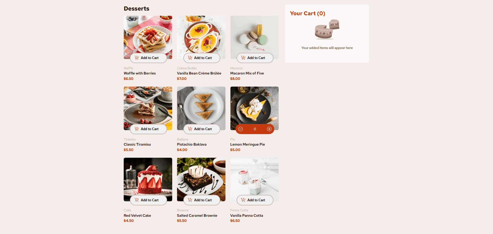
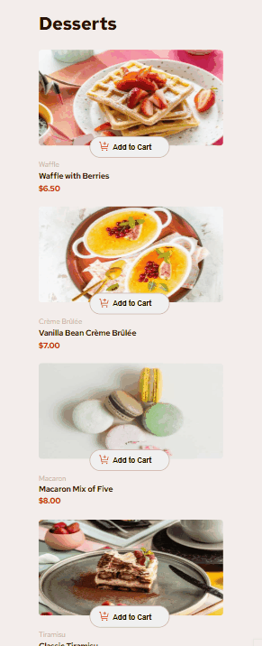

# Lista de Produtos com Carrinho

Este projeto consiste no desenvolvimento de uma aplicação web voltada para a exibição de uma lista de produtos e o gerenciamento de um carrinho de compras. A aplicação foi construída utilizando React, uma biblioteca JavaScript moderna e eficiente para criação de interfaces interativas e responsivas.

## 🚀 Funcionalidades

- Exibição de uma lista de produtos.
- Adicionar produtos ao carrinho.
- Atualizar a quantidade de produtos no carrinho.
- Remover produtos do carrinho.
- Exibição do valor total do carrinho.
- Interface responsiva.

## 🛠️ Tecnologias Utilizadas

- <strong>React</strong>: Biblioteca para construção da interface do usuário.
- <strong>Context API</strong>: Para gerenciamento de estado global.
- <strong>Custom Hooks</strong>: Para encapsular lógica reutilizável.
- <strong>CSS</strong>: Para estilização da interface.

## 📸 Demonstração

### Versão Desktop

### Versão Mobile
